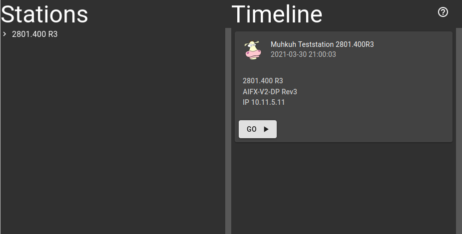

Teststation List
================

"Teststation List" is a web application for the Muhkuh tester framework which shows available test stations in a network.



Available test stations are announced with server sent events. The application collects all incoming events and displays them.

An event is send in JSON format. It has the following format:
```json
{
  "ssdp": {
    "uuid": "f15b8544-a26e-49b9-b7e9-34100817fdf9",
    "name": "Muhkuh Teststation 1234.567R1"
  },
  "test": {
    "title": "1234.567 R1",
    "subtitle": "SomeDevice R1"
  },
  "timestamp": "2021-03-25 14:08:50",
  "ip": "192.168.0.88",
  "port": 9090
}
```
